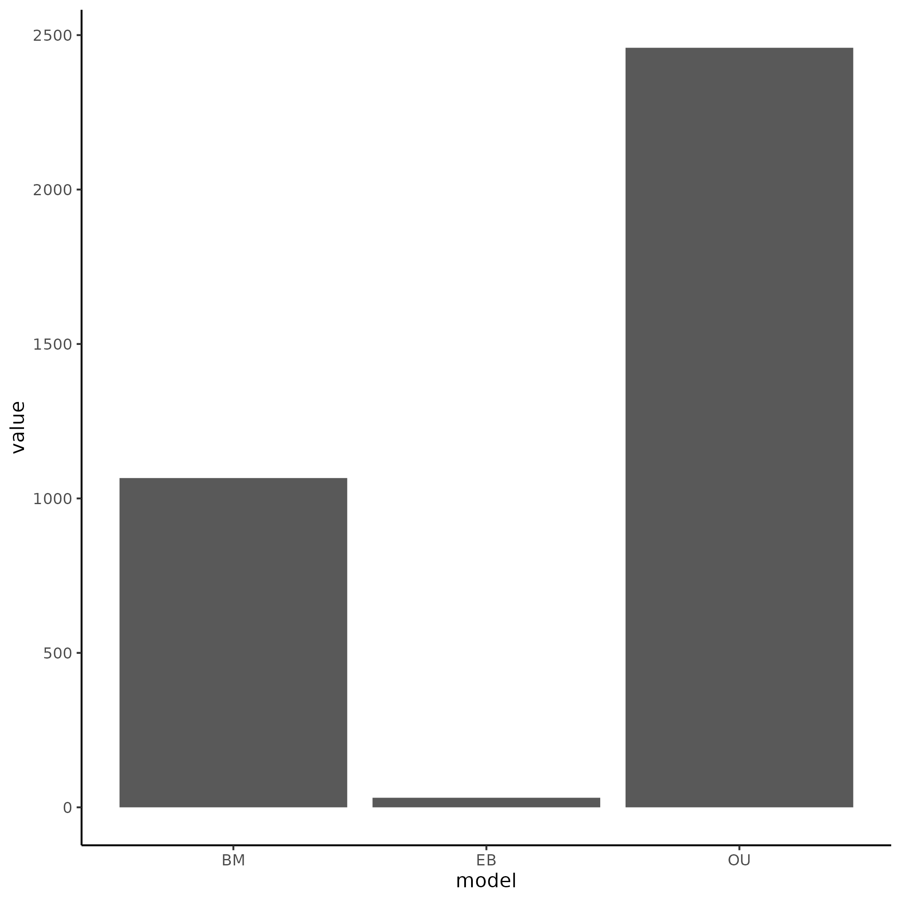
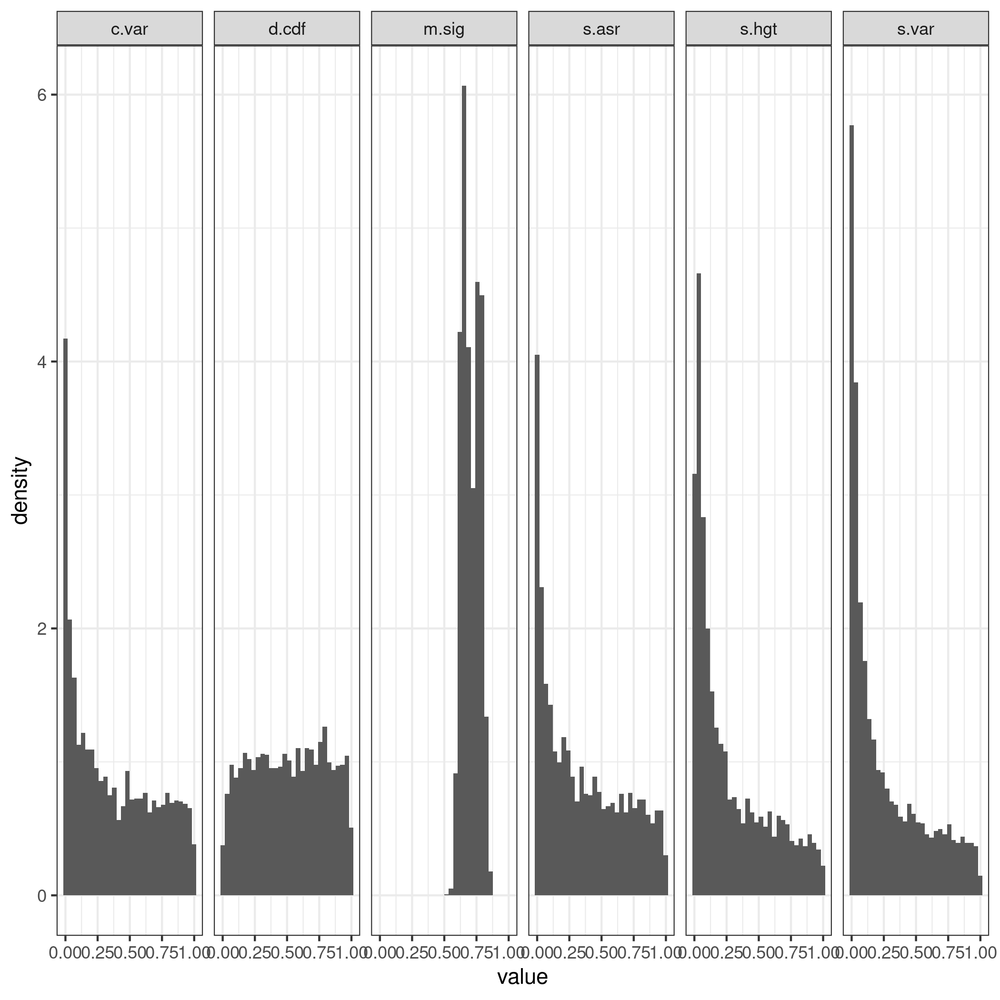
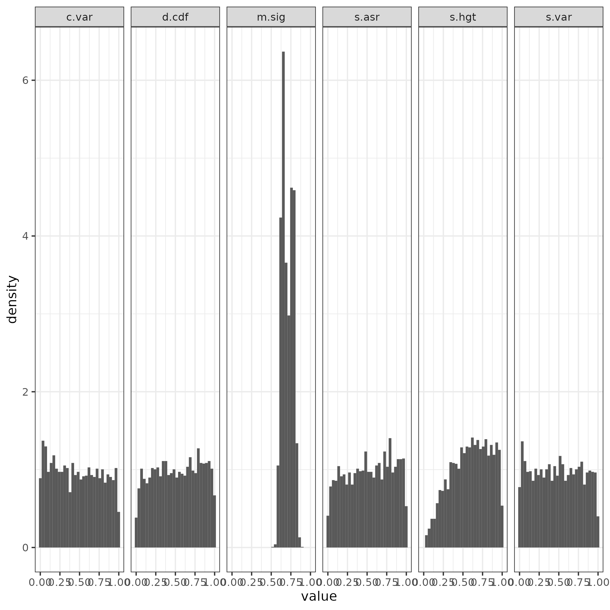
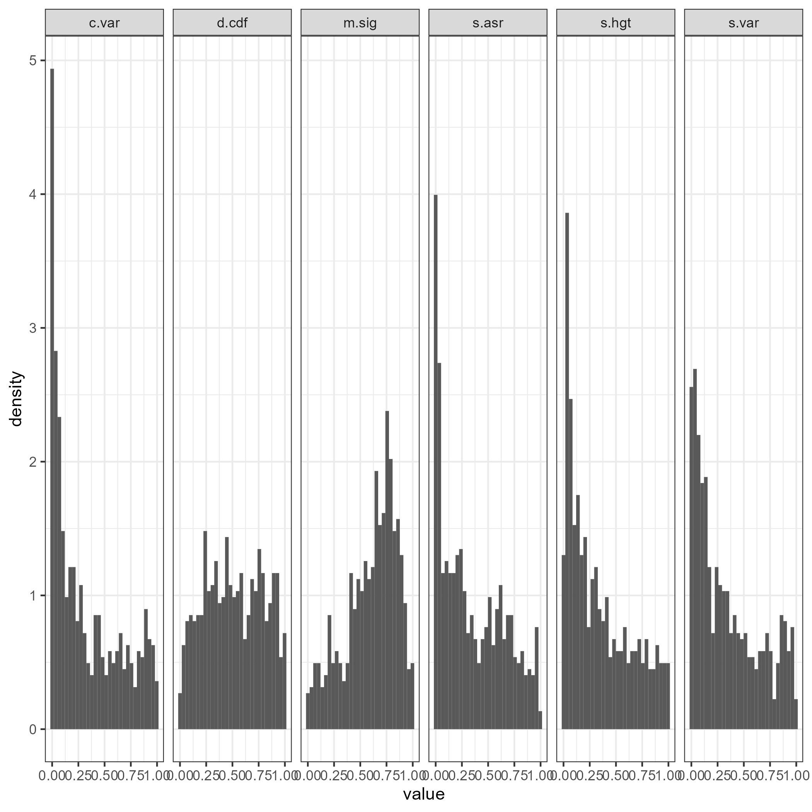
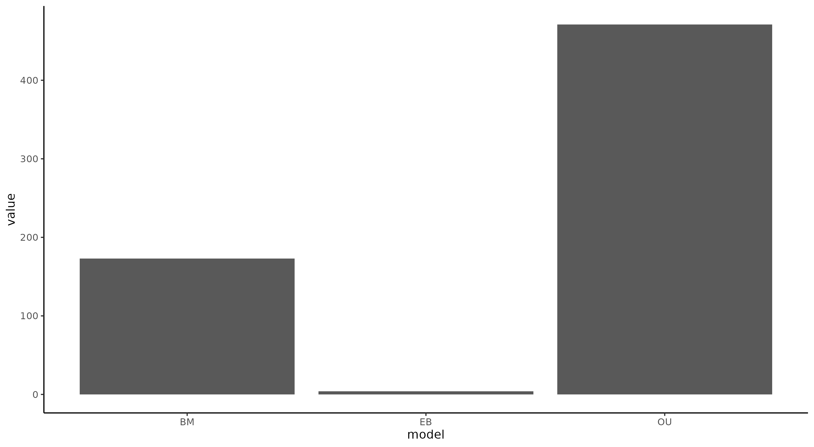
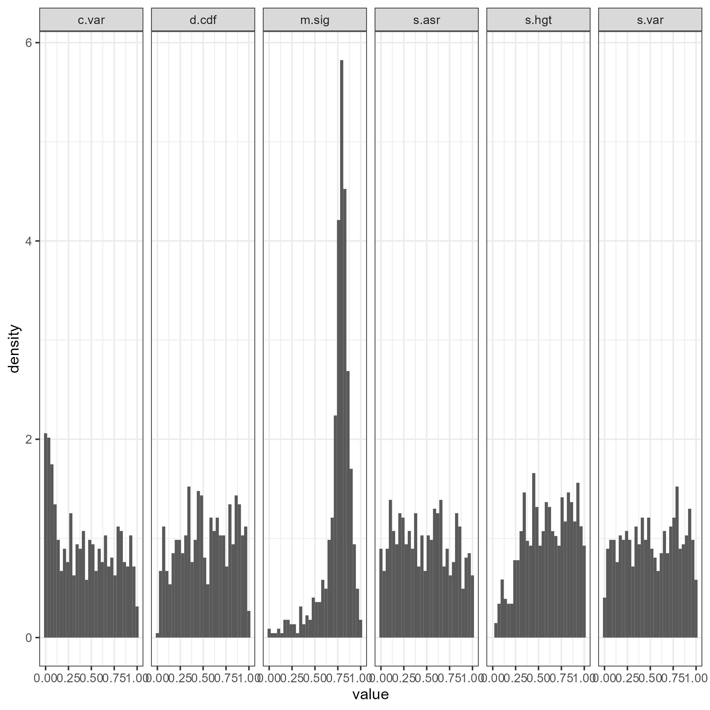

```{r setup, include=FALSE}
knitr::opts_chunk$set(echo = TRUE)

library(ape)
library(geiger)
library(phytools)
library(tidyverse)
library(arbutus)

CleanData <- function(phy, data) {
  cleaned <- treedata(phy,data,warnings=T)
  return(cleaned)
}
tree.file <- "Data/fungi_tree.tre"
gene.exp <- "Data/gene_expression_tpm_matrix_updated_Standard.LogNorm.tsv"

exp.df<- t(read.table(gene.exp,sep="\t",header=T,row.names = 1,stringsAsFactors = F))
tree <- read.tree(tree.file)
cleaned <- CleanData(phy = tree,exp.df)

dat <- cleaned$data
genes <- dim(dat)[2] %>% toString()
species <- dim(dat)[1] %>% toString()
```

## Summary of Data Set

The data set analyzed in this repository is taken from an analysis of related genes in a set of RNA-seq data across 18 species of fungi [1]. The repository containing the original analysis can be found [here](https://github.com/acope3/GeneExpression_coevolution). Across these `r species` species, `r genes` homologous proteins were analyzed for coevolution of their expression levels using a multivariate Brownian Motion model. From this analysis, the researchers concluded that certain proteins that physically interact show evidence of coevolution, and that PCMs are uniquely suited to detect this evolution [1]. In this analysis, I will reanalyze the methods they used to come to their conclusions and determine if the a BM model is appropriate for the given data set.

## Methods

I will first conduct a relative fit analysis via Akaike Information Criterion (AIC) [2] to compare, in a relative sense, how well the data fits the chosen model against alternative models. These models being Early Burst (EB)[3] and Ornstein-Uhlenbeck (OU)[4]. Next, I will perform an adequacy analysis of their chosen model for their data using the program arbutus [5]. Finally, I will analyze the adequacy of the "best fit" model chosen by the relative fit test mentioned above.

## Results

Analysis of the best model out of a set of BM, OU, and EB shows that the OU model can account for a majority of the data set, as shown by the plot below.



**Figure 1: Histogram showing the best-fit model for each gene-phylogeny pair.** Around 2500 of the genes showed a lowest AIC value for OU, while around 1000 showed a lowest AIC value for BM, with only a handful seemed best-fit for the EB model. This suggests that the OU model best describes most of the data compared to the other two.

However, the researchers did acknowledge that the OU model may have been a better fit overall for much of the data, but that a BM model would be adequate "enough" to describe the data due to the low number of tips present in the phylogenetic tree. To test this, I then used Arbutus to determine the adequacy of a pure BM model for the data, shown below.



**Figure 2. P-value distributions for each of the six test statistics when fitting data to BM model.** The test statistics, besides m.sig and d.cdf, display a sharp increase in count around the low end of p-values. This suggests that the data do not belong to the same distribution as one would expect based off of the phylogeny. Essentially, the BM model is not adequately suited to explain this data.

As shown in the plot above, a BM model was not adequate for this data set, as evidenced by the high amount of low p-values across the board for four out of the five test statistics measured (not including m.sig). Because the data set could not adequately be explained by the BM model, it is possible that the inferences drawn from their analysis do not hold up to scrutiny and re-analysis. I then compared this to an analysis of the data set but fitting the best-fit model according to the previous relative fit test.



**Figure 3. P-value distributions for each of the six test statistics when fitting data to the best fit model.** The test statistics, besides m.sig, display a uniform distribution of p-values. This suggests that the data is adequately explained by the corresponding model. S.hgt shows a low amount of p-values near the lower end of values.

Interestingly, when fitting the best available model to each gene, the models used were adequate across the board, as shown by the flat distribution of p-values. Notably, the s.hgt test statistic shows a low amount of p-values near the low end. This is likely caused by many of the genes having NA values for this test statistic. This means that the re-scaled tree for each of these genes has a conal shape, i.e., there was no phylogenetic signal for these genes when the best-fit model is used. The fact that this was not seen when fitting the BM model alone suggests that other models (EB or OU) may be too stringent with phylogenetic signal, or that the BM model is not stringent enough. Further analysis is necessary to determine which of the two possibilities explains this.

The authors of the paper also chose to exclude many of the genes that did not meet the assumptions of the BM model, leaving a total of 648 genes left for analysis. The plot below shows the same process as above, but for just those 648 genes. Additionally, I have calculated a standard error for each gene across species and used that in the fit of each model.



**Figure 4. P-value distributions for just the 648 genes that fit the assumptions of the BM model when fit to a BM model.** The distribution shows the same trend as Figure 2.



**Figure 5. Histogram showing the fit best-fit model for a gene-phylogeny pair for just genes that fit the assumptions of BM.** The trend is the same as Figure 1.



**Figure 6. P-value distributions for just the 648 genes that fit the assumptions of the BM model when fit to the best-fit model.** The trend remains the same as in Figure 3, except for the coefficient of variation, which accounts for rate variation across the phylogeny, which actually shows a lower adequacy for this subset of the data.

As stated earlier, a set of the genes have low phylogenetic signal when fitting the best-fit model, as shown by the genes that are missing values for s.hgt. An analysis of these genes...

## References

1.  Cope, A. L.; O'Meara, B. C.; Gilchrist, M. A. Gene Expression of Functionally-Related Genes Coevolves across Fungal Species: Detecting Coevolution of Gene Expression Using Phylogenetic Comparative Methods. *BMC Genomics* **2020**, *21* (1), 370. <https://doi.org/10.1186/s12864-020-6761-3.>
2.  Akaike, H.; Petrov, B. N.; Csaki, F. *Second International Symposium on Information Theory*; Akademia Kiado, 1973.
3.  Simpson, G. G. *Tempo and Mode in Evolution*; Columbia Univ. Press: New York, 1944.
4.  Hansen, T. F. Stabilizing Selection and the Comparative Analysis of Adaptation. *Evolution* **1997**, *51* (5), 1341–1351. <https://doi.org/10.1111/j.1558-5646.1997.tb01457.x.>
5.  Pennell, M. W.; FitzJohn, R. G.; Cornwell, W. K.; Harmon, L. J. Model Adequacy and the Macroevolution of Angiosperm Functional Traits. *The American Naturalist* **2015**, *186* (2), E33–E50. <https://doi.org/10.1086/682022.>
