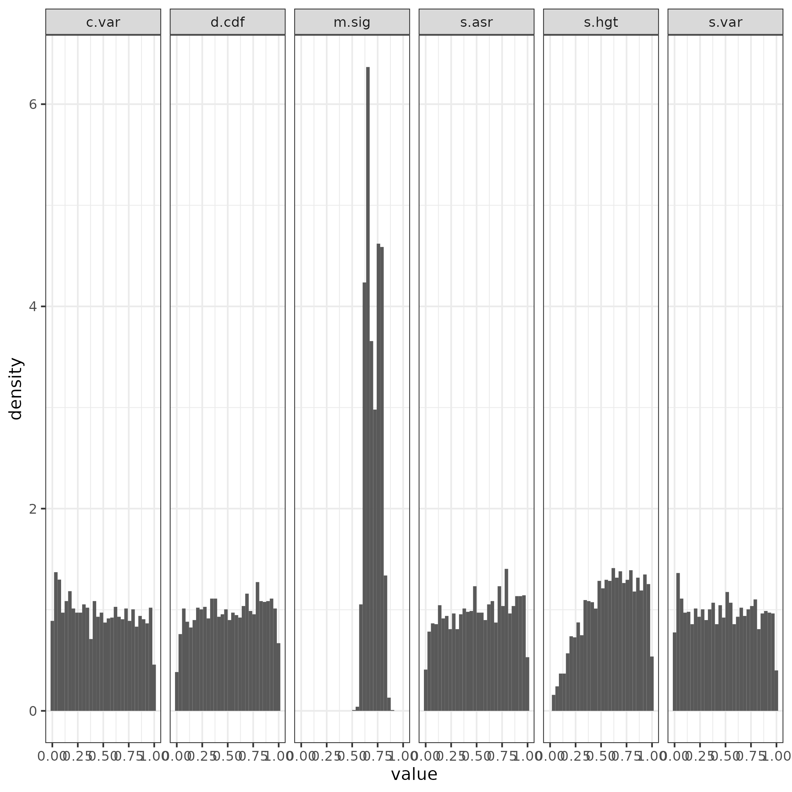

Analysis of Coevolution Dataset
================
Fiel Dimayacyac

## Summary of Data Set

The data set analyzed in this repository is taken from an analysis of
related genes in a set of RNA-seq data across 18 species of fungi \[1\].
The repository containing the original analysis can be found
[here](https://github.com/acope3/GeneExpression_coevolution). Across
these 18 species, 3556 homologous proteins were analyzed for coevolution
of their expression levels using a multivariate Brownian Motion model.
From this analysis, the researchers concluded that certain proteins that
physically interact show evidence of coevolution, and that PCMs are
uniquely suited to detect this evolution \[1\]. In this analysis, I will
reanalyze the methods they used to come to their conclusions and
determine if the a BM model is appropriate for the given data set.

## Methods

I will first conduct a relative fit analysis via Akaike Information
Criterion (AIC) \[2\] to compare, in a relative sense, how well the data
fits the chosen model against alternative models. These models being
Early Burst (EB)\[3\] and Ornstein-Uhlenbeck (OU)\[4\]. Next, I will
perform an adequacy analysis of their chosen model for their data using
the program arbutus \[5\]. Finally, I will analyze the adequacy of the
“best fit” model chosen by the relative fit test mentioned above.

## Results

Analysis of the best model out of a set of BM, OU, and EB shows that the
OU model can account for a majority of the data set, as shown by the
plot below.

However, the researchers did acknowledge that the OU model may have been
a better fit overall, but that a BM model would be adequate “enough” to
describe the data due to the number of tips present in the phylogeny. To
test this, I then determined the adequacy of a pure BM model for the
data, shown below.

As shown in the plot above, a BM model was not adequate for this data
set, as evidenced by the high amount of low p-values across the board
for four out of the five test statistics measured. I then compared this
to an analysis of the data set but fitting the best-fit model according
to the previous relative fit test.

Interestingly, when fitting the best available model to each data, the
models used were adequate for the data across the board.

## References

1.  Cope, A. L.; O’Meara, B. C.; Gilchrist, M. A. Gene Expression of
    Functionally-Related Genes Coevolves across Fungal Species:
    Detecting Coevolution of Gene Expression Using Phylogenetic
    Comparative Methods. *BMC Genomics* **2020**, *21* (1), 370.
    <https://doi.org/10.1186/s12864-020-6761-3.>
